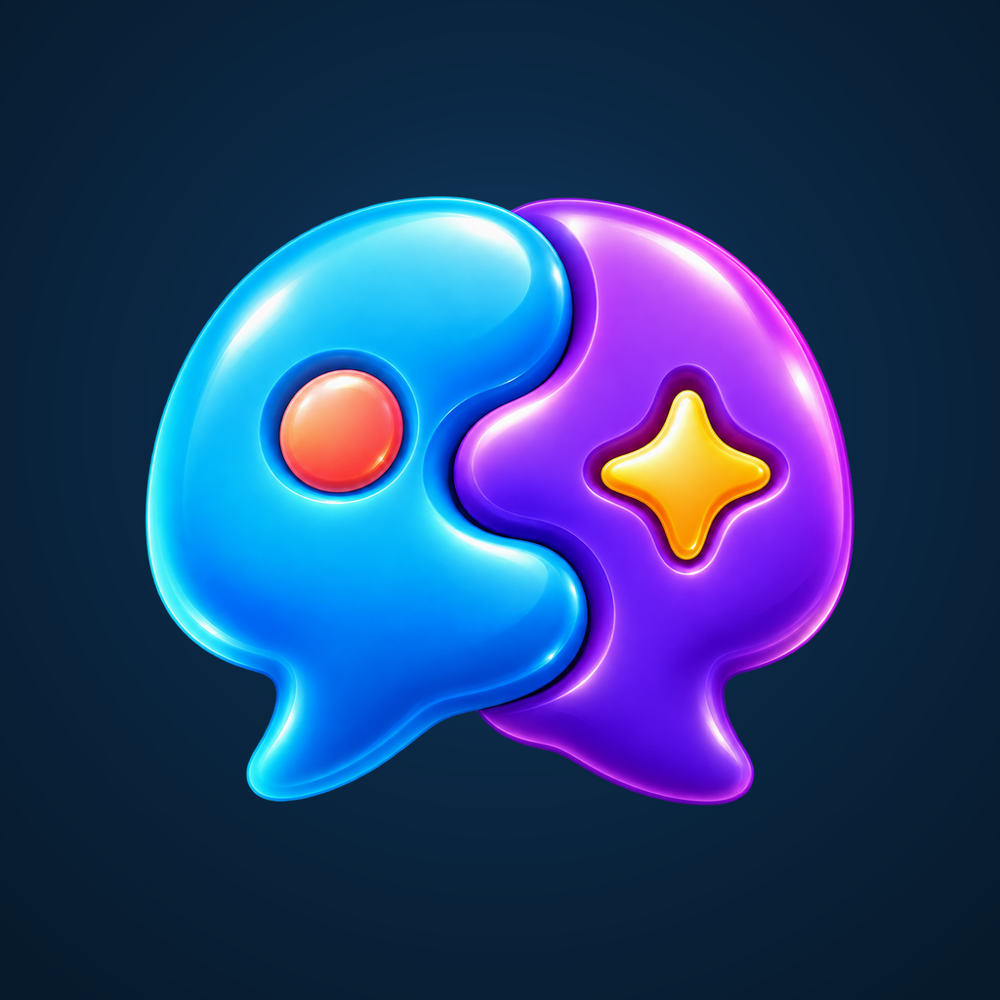

# Phron

Board games and brain puzzles, played together or on your own.

Phron brings chess, dama, connect four, dominos, okey, sudoku, word games, memory challenges, and more into one app. Challenge friends online, play together locally, or enjoy solo puzzles. Modes vary by game.

Available in English, Arabic, Spanish, German, Portuguese, Italian, Kurdish (Sorani), and Danish.

## Public links

- [Privacy policy](https://auderhama.github.io/Phron/)
- [Support and contact](https://auderhama.github.io/Phron/#contact)
- [Account deletion](https://auderhama.github.io/Phron/delete-account.html)

## This repository

This repository contains Phron's public website, privacy policy, account-deletion instructions, and public image assets. The mobile application source and credentials are maintained separately.

GitHub Pages publishes the `docs/` directory from the `main` branch.

## Contact

[privacy@phron.com](mailto:privacy@phron.com)
